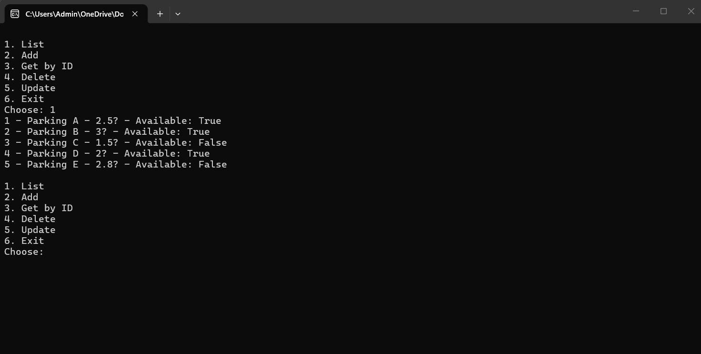
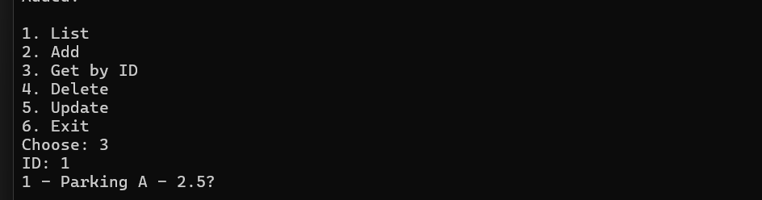
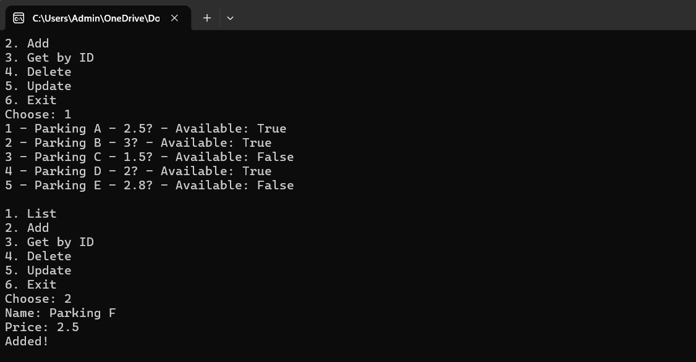
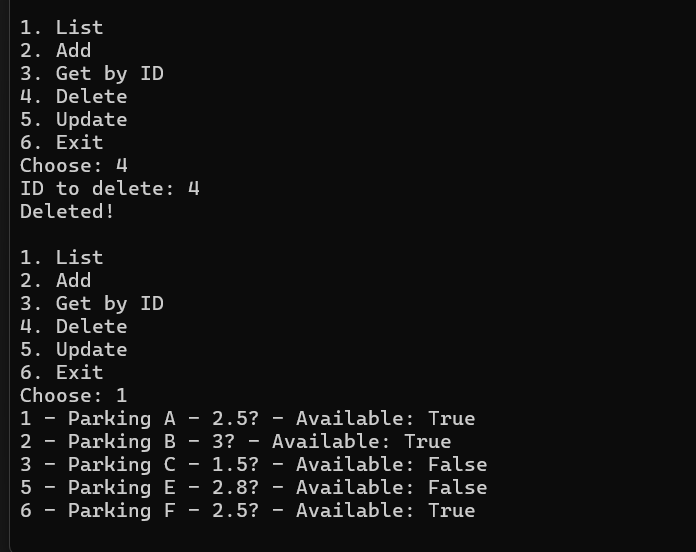
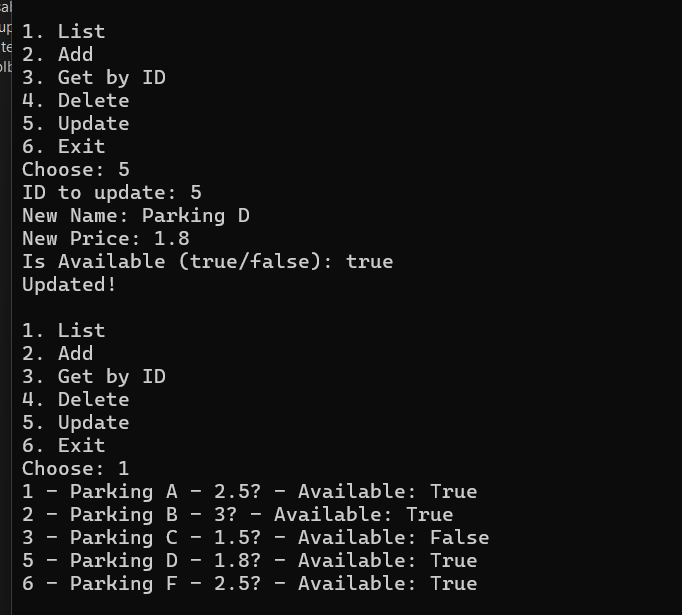

# Smart Parking System – Implementation

## Overview

This project implements a **Smart Parking System** using a layered architecture:

* **Repository Layer** → Handles data access from CSV file
* **Service Layer** → Contains business logic and validation
* **UI Layer (Console)** → Provides user interaction through a menu

---

## Architecture Flow

UI → Service → Repository → CSV File

---

## Features Implemented

### 1. List Parking Spots

Displays all parking spots stored in the CSV file.
Supports optional filtering by name.

### 2. Add Parking Spot

Adds a new parking spot with validation:

* Name must not be empty
* Price must be greater than 0

### 3. Get Parking Spot by ID

Retrieves a specific parking spot using its ID.

### 4. Update Parking Spot

Updates existing parking spot data:

* Name
* Price per hour
* Availability

### 5. Delete Parking Spot

Deletes a parking spot by ID.

---

## Data Storage

Data is stored in a file called **data.csv**.

Each record has the following format:

Id,Name,PricePerHour,IsAvailable

Example:
1,Parking A,2.5,true
2,Parking B,3.0,false
3,Parking C,1.5,true
4,Parking D,2.0,true
5,Parking E,4.0,false

---

## CRUD Operations

* **Create** → Add()
* **Read** → List(), GetById()
* **Update** → Update()
* **Delete** → Delete()

All CRUD operations are fully functional and connected end-to-end.

---

## Example Output

1. List
2. Add
3. Get by ID
4. Delete
5. Update
6. Exit

Choose: 2
Name: Parking X
Price: 2.5

Added!

---

## Validation

The system ensures:

* Parking name cannot be empty
* Price per hour must be greater than 0

If validation fails, an error message is displayed.

---

## Notes

* The system automatically assigns IDs when adding new records
* Data persists in the CSV file
* All operations update the file immediately

---

## Conclusion

The Smart Parking System successfully implements:

* Layered architecture
* File-based data persistence
* Full CRUD functionality
* Input validation
* Functional console-based UI

All requirements of the assignment are fulfilled.
## Screenshots

### List

### getbyid

### post

### delete

### update

